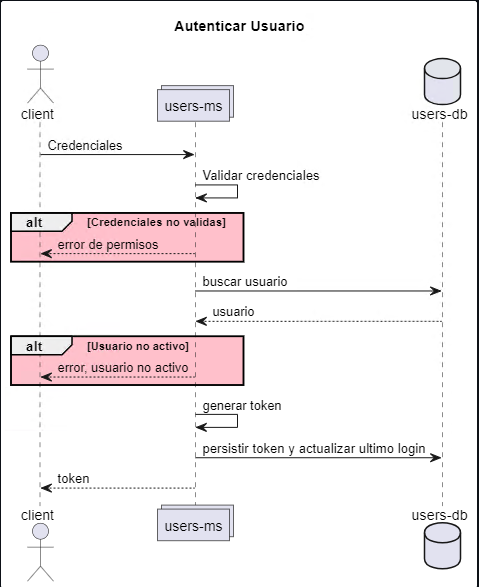
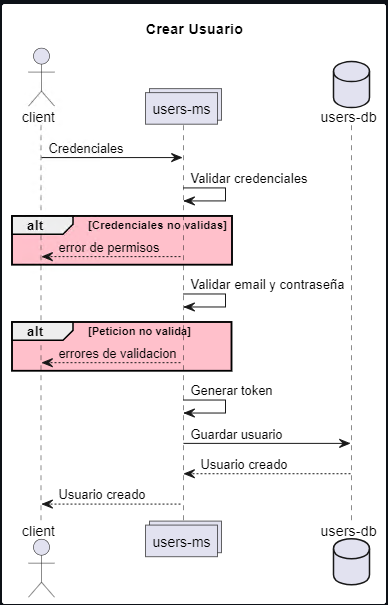
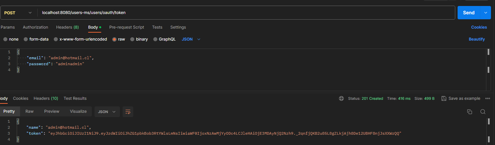
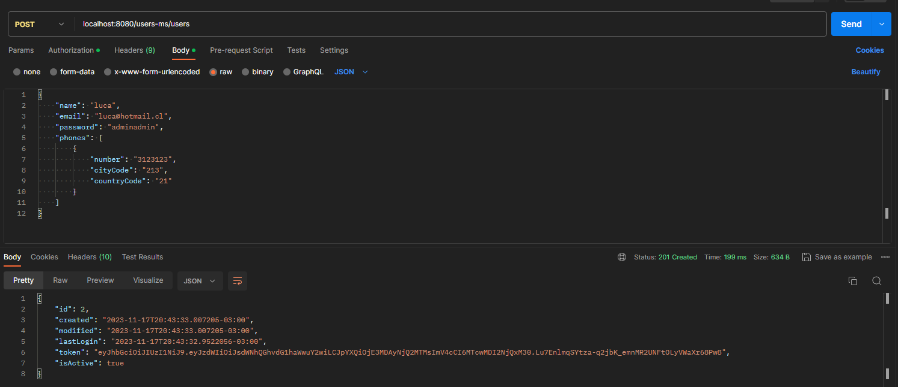

# nisum-challenge
Esta es la resolucion del challenge de Nisum para crear una API de Creación y Autenticación de Usuarios. Implementada en
Java 17 y Spring Boot 3. Además utiliza Spring Security para la autenticación de usuarios, Spring Data JPA para el
manejo de bases de datos, H2 como DB local y Flyway para crear una estructura inicial de la DB.

## Diseño
Este sistema consiste de un microservicio, *users-ms*, y en una DB para guardar los usuarios. A continuación se muestra
en un pequeño diagrama de secuencia la interación de un cliente con las funcionalidades del sistema.

#### Autenticar Usuario

#### Crear Usuario

## ¿Como Probarlo?
La forma mas sencilla es abrir el proyecto con un IDE como Intellij o Eclipse, ejecutar las tareas clean y build, y
ejecutar la aplicación desde el IDE (no requiere ningún perfil en particular), ya que si se desea ejecutar por linea de
comandos se debe tener instalado Gradle y Java 17.

Esta aplicación posee dos endpoints:

    - Crear usuario
    - Autenticar usuario

En la carpeta ./docs se encuentra una colección de Postman para probarlos. Todos los endpoints, salvo el de autenticar
usuario y consultar la consola h2, se encuentran protegidos y requieren autenticación para usarse (no requieren ningun
permiso especifico, solo estar autenticado, en este caso solo existe otro mas, el de Crear Usuario, pero si se añaden
otros tambien estarán protegidos).

#### Autenticar Usuario
Para ello ingresamos el email y la contraseña del usuario que queremos autenticar (al inciar la aplicación se crea un
usuario admin por defecto en la migración de Flyway) y generamos un token.

#### Crear Usuario
Para ello ingresamos el token previamente obtenido e ingresamos los datos correspondientes para crear el usuario.

En este endpoint se realizan 3 validaciones sobre la peticion:

    - Que el email no este registrado
    - Que el email sea valido en base a una regex (parametrizada en el archivo application.yml)
    - Que la contraseña sea valida en base a una regex (parametrizada en el archivo application.yml)
